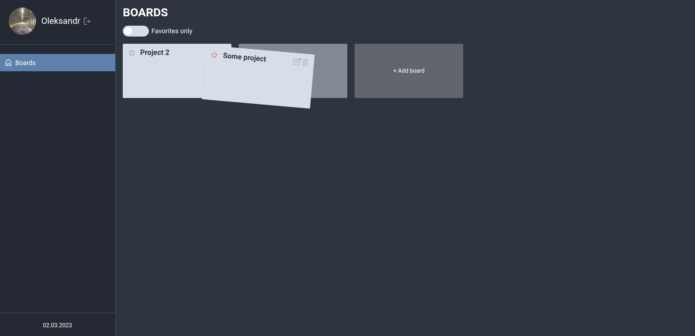
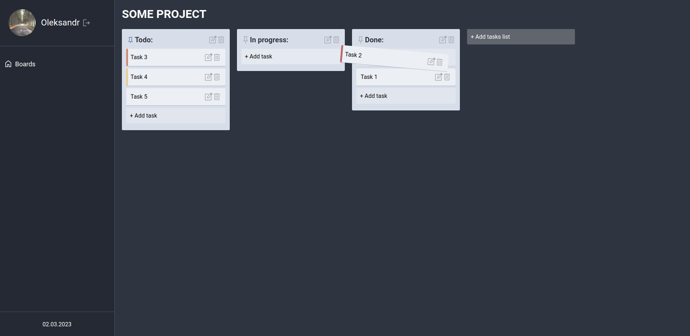

# Trello clone app

This project was bootstrapped with [Create React App](https://github.com/facebook/create-react-app).

## Node version

v18.13.0

## Available Scripts

### `npm run dev`

Runs the app in the development mode.\
Open [http://localhost:3000](http://localhost:3000) to view it in the browser.

### `npm run dev:mock`

Runs the app in the development mode with mocked API.\
Open [http://localhost:3000](http://localhost:3000) to view it in the browser.

### `npm test`

Launches the test runner in the interactive watch mode.\

### `npm run build`

Builds the app for production to the `build` folder.\

### `npm run prettier-check`

Runs Prettier check

### `npm run prettier`

Runs Prettier in `write` mode. That will format all files that placed in the `src` folder.

### `npm run sb`

Runs Storybook on the live mode.

### `npm run build-sb`

Builds Storybook.
